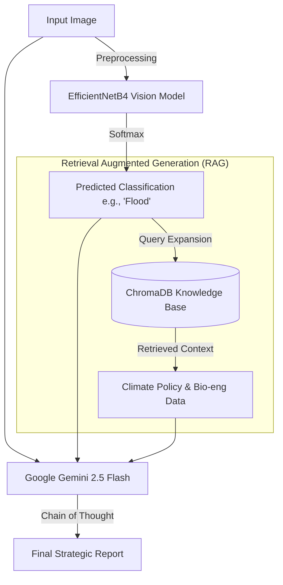

# 🌪️ Multi-Modal Climate Disaster Response Agent

An autonomous agentic system that combines computer vision, vector retrieval, and multimodal Generative AI to analyze disaster imagery and generate policy-compliant mitigation reports.

## 🏗️ Architecture Design

This system implements a **Neuro-Symbolic AI architecture**, combining neural perception (computer vision) with symbolic reasoning (RAG + LLM).



## 🛠️ Tech Stack

* **Computer Vision Training:** TensorFlow/Keras, EfficientNetB4 (Transfer Learning).
* **Multimodal LLM:** Google Gemini 2.5 Flash (via new `google-genai` SDK).
* **Vector Database:** ChromaDB (in-memory for rapid context retrieval).
* **Embeddings:** HuggingFace (`all-MiniLM-L6-v2`).
* **Training Optimization:** Mixed Precision (`float16`).

## 📊 Performance Metrics (Model Training)

The vision component was trained on a dataset of ~9,500 images across 12 disaster classes.

| Metric | Result (Validation Set) | Notes |
| --- | --- | --- |
| **Final Accuracy** | **91.32%** | Achieved after 8 epochs of fine-tuning. |
| **Final Loss** | **0.3044** | Demonstrates strong convergence without overfitting. |
| **Training Time** | ~20 mins | Optimized using T4 GPU and Mixed Precision. |
| **Inference Latency** | < 2s (end-to-end) | Includes vision prediction, retrieval, and LLM generation. |

*Note: Confusion matrices indicate strong performance across distinct categories, with minor confusion between visually similar sub-classes (e.g., different types of wind damage).*

## 🔧 Key Engineering Decisions & Trade-offs

**1. Why EfficientNetB4 over ResNet50?**

* **Decision:** Used EfficientNetB4 for the vision backbone.
* **Trade-off:** EfficientNet uses compound scaling to achieve better accuracy with fewer parameters than ResNet, resulting in faster training and inference on constrained cloud resources (like Colab T4 GPUs), despite being slightly more complex architecturally.

**2. Mixed Precision Training (`float16`)**

* **Decision:** Implemented TensorFlow mixed precision policies.
* **Trade-off:** Sacrificed a tiny fraction of numerical precision for a ~2x speedup in training time and reduced GPU memory usage, allowing for larger batch sizes.

**3. In-memory ChromaDB vs. External Vector DB**

* **Decision:** Used ChromaDB in persistent local mode.
* **Trade-off:** Since the "Climate Intelligence Policy" knowledge base is currently small and static, an in-memory solution reduces architectural complexity and network latency compared to setting up an external service like Pinecone or Weaviate.

**4. Agentic LLM: Gemini 2.5 Flash**

* **Decision:** Chosen for the final reasoning step.
* **Reasoning:** Its native multimodal capabilities allow it to "see" the image directly while simultaneously processing the retrieved textual context, leading to more grounded reports than text-only models.

## 🚀 How to Run the Agent Locally

1. **Clone the repository:**
```bash
git clone [https://github.com/YOUR_USERNAME/Disaster-Response-Agent.git](https://github.com/YOUR_USERNAME/Disaster-Response-Agent.git)
cd Disaster-Response-Agent

```


2. **Install dependencies:**
```bash
pip install -r requirements.txt

```


3. **Set your Google API Key:**
```bash
# Linux/Mac
export GEMINI_API_KEY="your_new_api_key_here"
# Windows PowerShell
$env:GEMINI_API_KEY="your_new_api_key_here"

```


4. **Run the Agent Inference Script:**
*Note: You need the trained `.keras` model file present.*
```bash
python run_agent.py

```


