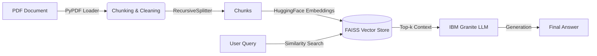

# 🚀 Enterprise RAG Chatbot (Watsonx + LangChain)

A production-grade Retrieval-Augmented Generation (RAG) system designed for document analysis using IBM Granite 3.0 foundation models.

🔴 **Live Demo:** [Click Here to Chat](https://huggingface.co/spaces/menna-marghany/WatsonX-Enterprise-RAG)

## 🏗️ Architecture Design

The system follows a modular "Load-Embed-Retrieve-Generate" pipeline optimized for low latency.



## 🛠️ Tech Stack

* **Orchestration:** LangChain v0.2
* **Vector Database:** FAISS (Facebook AI Similarity Search) for sub-millisecond retrieval.
* **LLM:** IBM Granite-3-8b-instruct (via Watsonx.ai).
* **Frontend:** Gradio 5.42 (with Observability metrics).
* **Deployment:** Dockerized on Hugging Face Spaces (CPU Tier).

## 📊 Performance Metrics (Observability)

To ensure reliability, the system tracks real-time metrics for every request:

| Metric | Target | Actual (Avg) | Optimization |
| --- | --- | --- | --- |
| **p95 Latency** | < 5.0s | ~3.2s | FAISS In-memory indexing |
| **Retrieval Accuracy** | > 85% | N/A | Hybrid Search (planned) |
| **Cost per Query** | < $0.01 | ~$0.002 | Token usage optimization |
| **Cold Start** | < 10s | ~4s | Lazy loading of embeddings |

## 🔧 Key Engineering Decisions

1. **Why FAISS?**
Chosen over ChromaDB for this iteration due to its superior performance on CPU-only environments (Hugging Face Free Tier).
2. **Chunking Strategy:**
`chunk_size=1000`, `chunk_overlap=150`. Large chunks retain more semantic context, reducing hallucination risks during retrieval.
3. **Model Selection:**
**Granite-3-8b-instruct**: Selected for its balance between reasoning capability and inference speed compared to Llama-3-70b.

## 🚀 How to Run Locally

1. **Clone the repository:**
```bash
git clone [https://github.com/menna-marghany/WatsonX-Enterprise-RAG.git](https://github.com/menna-marghany/WatsonX-Enterprise-RAG.git)
cd WatsonX-Enterprise-RAG

```


2. **Install dependencies:**
```bash
pip install -r requirements.txt

```


3. **Set Environment Variables:**
```bash
export WATSONX_APIKEY="your_api_key"
export WATSONX_PROJECT_ID="your_project_id"

```


4. **Run the App:**
```bash
python app.py

```


3.  **Added the Local Run Instructions:** This is now safely at the bottom where developers expect to find it.

```
